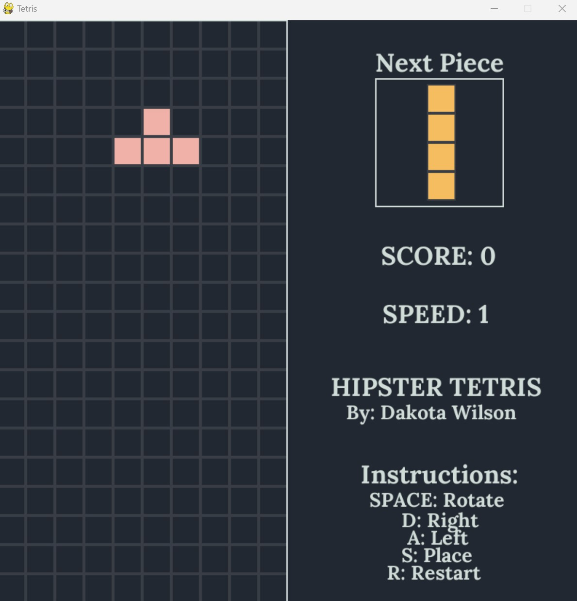
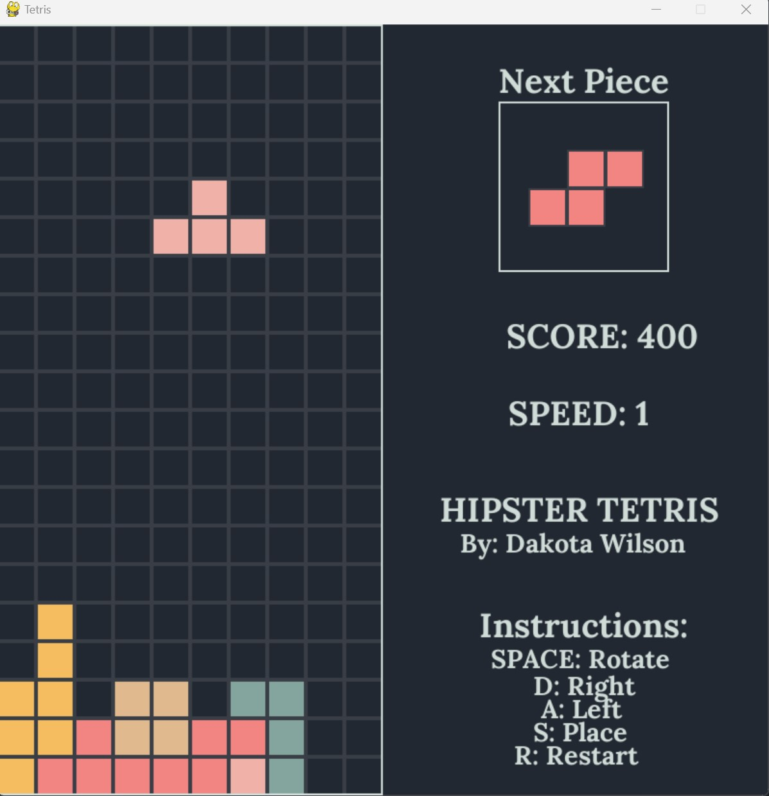
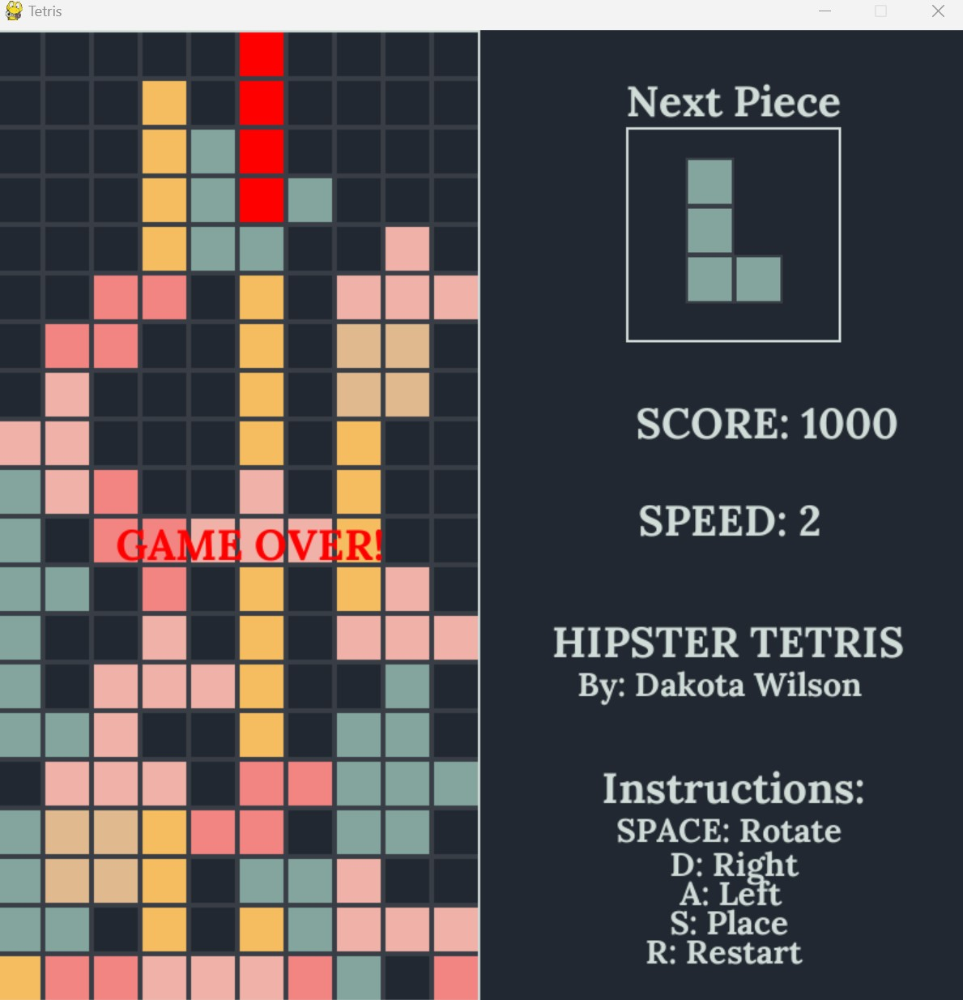

## P01 - Tiled Game or Tetris
### Dakota Wilson
### Description:

A Pygame version of Tetris using classes with OOP principles. A class assignment to make a tile based game that has collisions.

### Files

|   #   | File            | Description                                        |
| :---: | --------------- | -------------------------------------------------- |
|   1   | Game.py         | Main driver of my project that launches the game.  |
|   2   | Shapes.py       | Base class for shapes.                             |
|   3   | I.py            | I shape child class.                               |
|   4   | L.py            | L shape child class.                               |
|   5   | O.py            | O shape child class.                               |
|   6   | S.py            | S shape child class.                               |
|   7   | T.py            | T shape child class.                               |
|   8   | NextBox.py      | Class for the next shape box.                      |
|   9   | Fonts           | Folder with used fonts.                            |
|   10  | Audio           | Folder with Audio used in game.                    |
|   11  | Images          | Folder with screenshots of the game.               |

### Instructions

- Make sure you install library `pygame.py`

- Example Command:
    - `python Game.py`

#### Screen Shots:

