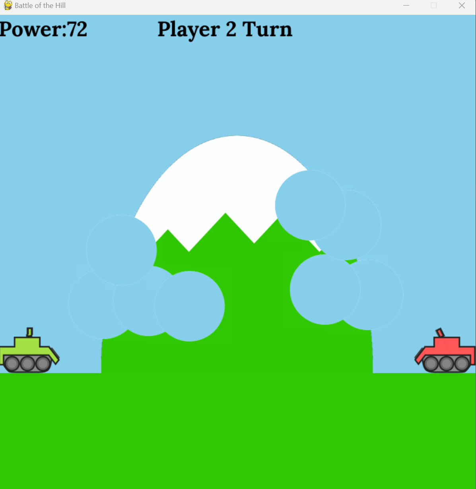
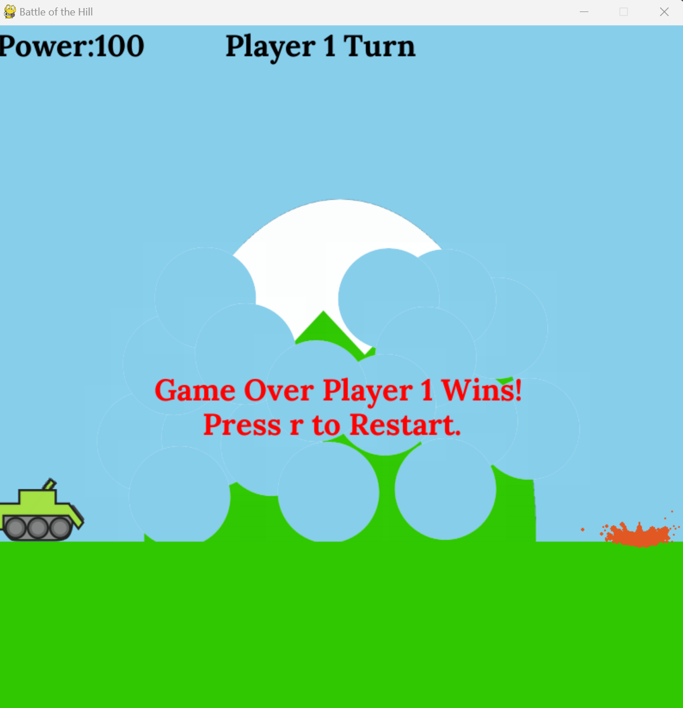
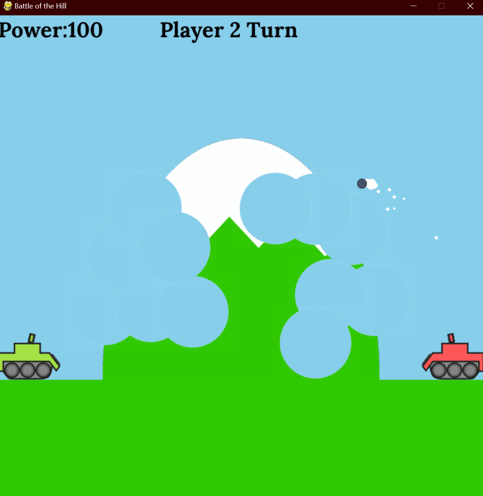
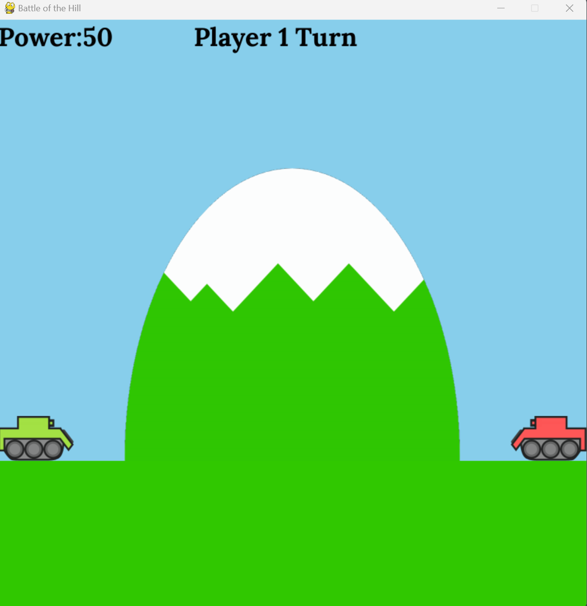

## P02 - Projectile Dual
### Dakota Wilson
### Description:

A turn based tank shooter written in pygame. This game involves projectile motion on projectiles with given power shot out of a tank. The goal is to destroy your opponent using specific strategy of cratering a hill to find a shot to take out the enemy.

### Files

|   #   | File            | Description                                        |
| :---: | --------------- | -------------------------------------------------- |
|   1   | main.py         | Main file that starts the game.                    |
|   2   | GameDriver.py   | The driver file that does all the game logic.      |
|   3   | Tank.py         | Class for the tank sprite.                         |
|   4   | TankArm.py      | Class for the tank arm sprite.                     |
|   5   | Hill.py         | Class for the Hill sprite.                         |
|   6   | Ground.py       | Class for the Ground sprite.                       |
|   7   | Crater.py       | Class for the Crater sprite.                       |
|   8   | Projectile.py   | Class for the Projectile sprite.                   |
|   9   | Particle.py     | Class for particles.                               |
|   10  | Dust.py         | Class for dust (collection of particles).          |
|   11  | Fonts           | Folder with used fonts.                            |
|   12  | Sounds          | Folder with Audio used in game.                    |
|   13  | Images          | Folder with screenshots of the game.               |
|   14  | Tanks           | Folder with Images of the tanks Used               |
|   14  | Crater          | Folder with Images of the Crater Used              |
|   14  | Hill            | Folder with Images of the Hill Used                |

### Instructions

- Make sure you install library `pygame`
- Make sure you install library `Pillow`

- Example Command:
    - `python main.py`

#### Screen Shots:

