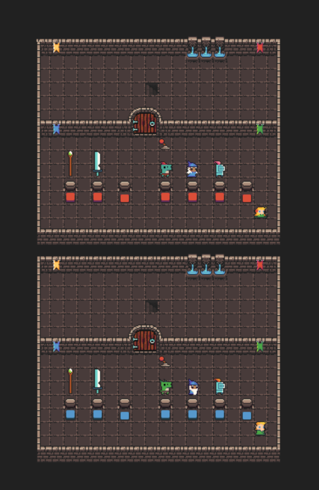

## P04 - Multiplayer Tile Based Game - Dungen Crawler
### Dakota Wilson
### Description:

- The game is a dungeon crawler where the players must defeat enemies and collaborate to portal to different areas in the level and continue to the next level. The game is multiplayer and uses RabbitMQ to communicate between the two players. The game uses the tiled map editor to create the levels and the game uses the pytmx library to load the levels into the game. 
The game uses the pygame library to render the game and handle the game logic.
The game uses the pika library to communicate between the client and server. 
### Files

|   #   | File            | Description                                        |
| :---: | --------------- | -------------------------------------------------- |
|   1   | Comms.py        | The class for communicaitons with RabbitMQ server. |
|   2   | GameDriver.py   | The class that handles all game functionality.     |
|   3   | Goblin.py       | The class for the NPC animation.                   |
|   4   | GUI.py          | The GUI class for displaying the health and score. |
|   5   | HealthBar.py    | The class that updates the Health of the player.   |
|   6   | LevelOne.py     | The class that handles the logic for level one.    |
|   7   | LevelTwo.py     | The class that handles the logic for level two.    |
|   8   | LevelThree.py   | The class that handles the logic for level three.  |
|   9   | main.py         | The main driver that launches the game.            |
|   10  | Map.py          | The class for loading the tiled map                |
|   11  | Messenger.py    | The class for message passing.                     |
|   12  | Player.py       | The class that handles the players animations.     |
|   14  | requirements.txt| The file to load all requirements to run the game. |
|   13  | Score.py        | The class that updates the players score.          |
|   14  | SpriteSheet.py  | The function for processing sprites in the game.   |
|   15  | StartLevel.py   | The class for starting player selection.           |
|   16  | Tile.py         | The class for the tile properties.                 |
|   17  | Weapon.py       | The class for handling the players weapon.         |
|   18  | Assets          | Folder with Dungeon tile sheet, fonts, and sounds. |
|   19  | Helper          | Folder with started code and resources.            |
|   20  | Levels          | Folder with the tiled .tmx levels used in the game.|

### Instructions

- Make sure you install library the requirements.txt before running the game.

- Example Command:
    - `python main.py game-06 player-09`
    or
    - `python3 main.py game-06 player-10`

#### Screen Shots:
- Start Level

- Level One

- Level Two

- Level Three

